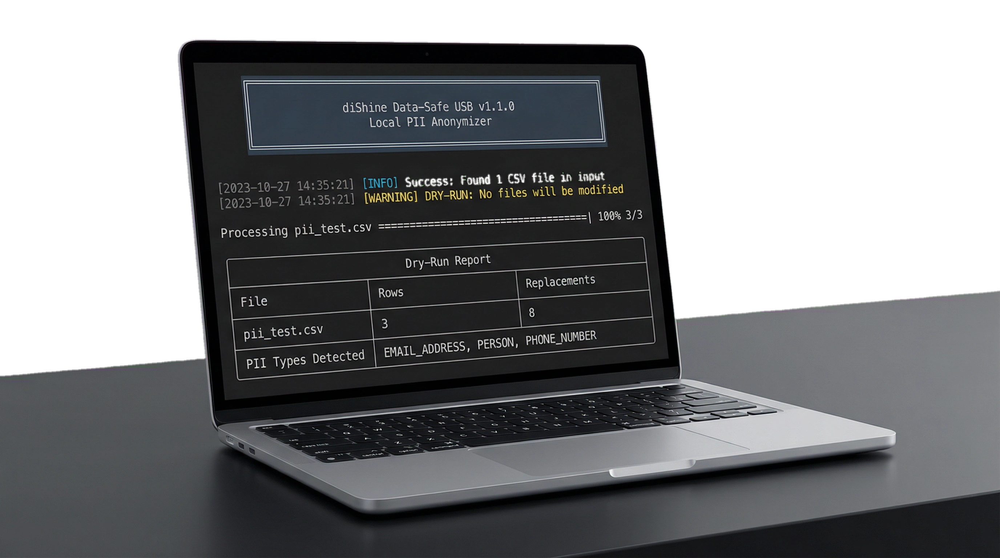
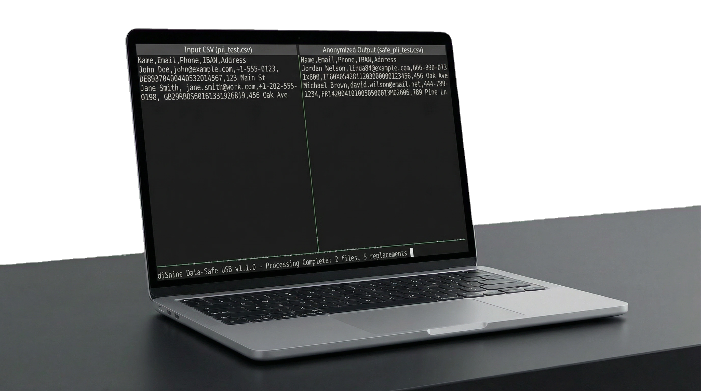
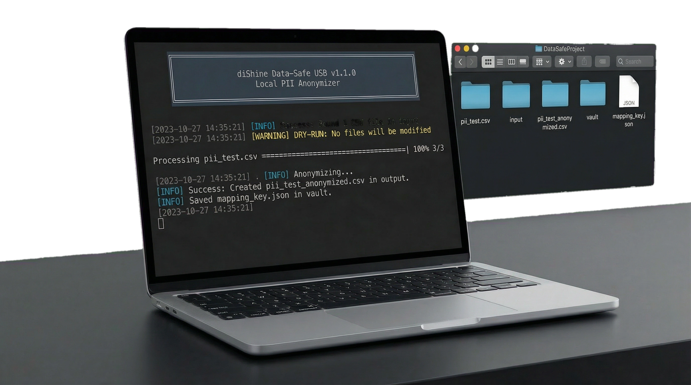
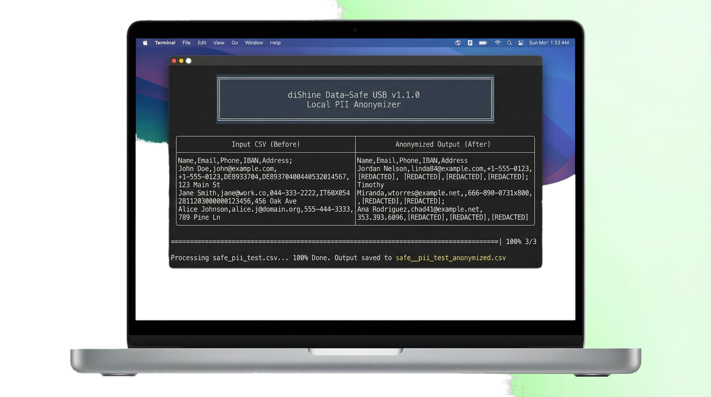

# diShine Data-Safe USB: Local PII anonymizer for CSV files

<p align="center">
  
</p>

Strip names, emails, phone numbers, and other personally identifiable information from your data before uploading it to cloud AI services. Everything runs on your machine — nothing leaves your computer.
Built by [diShine](https://dishine.it) 

<p align="center">
  
  
</p>

<p align="center">
  
</p>

---

## What It Does

Cloud AI tools like ChatGPT and Claude are powerful for data analysis, but uploading raw customer lists, HR records, or sales data creates real privacy and compliance risks.

Data-Safe USB sits between your raw data and the cloud. It scans CSV files for PII (names, emails, phone numbers, IBANs, credit card numbers, locations, dates), replaces each value with a realistic fake, and writes a clean file you can safely upload. A local vault stores the original-to-fake mapping so you can reverse the process when needed.

Key properties:

- **Fully offline** — powered by [Microsoft Presidio](https://github.com/microsoft/presidio) and [spaCy](https://spacy.io/) running locally
- **Deterministic replacements** — the same input always produces the same fake output, preserving relational consistency across rows and files
- **Batch processing** — drop multiple CSVs into the input folder and process them all at once
- **Reversible** — the vault mapping lets you map back to original values when needed
- **Simple CLI** — progress bars, summary tables, dry-run mode

---

## Quick Start

### 1. Setup (one-time)

Requires **Python 3.9+** and an internet connection for the initial model download.

```bash
chmod +x setup.sh
./setup.sh
```

This creates a virtual environment, installs dependencies, and downloads the spaCy NLP model (~400 MB).

### 2. Anonymize

Drop your CSV file(s) into the `input/` folder, then run:

```bash
# On macOS — double-click Data_Safe.command, or:
./Data_Safe.command

# Or directly:
source venv/bin/activate
python Data_Safe.py
```

Your anonymized file(s) appear in `output/`, prefixed with `safe_`.

### 3. Reverse anonymization

To restore an anonymized file to its original values using the vault mapping:

```bash
python Data_Safe.py --reverse
```

This reads the `safe_*.csv` files from `output/`, applies the vault mapping in reverse, and writes `restored_*` files to `input/`.

### 4. Check the results

```bash
# Preview what PII would be detected without modifying anything
python Data_Safe.py --dry-run
```

---

## CLI Options

```
python Data_Safe.py [OPTIONS]

Options:
  --version      Show version and exit
  --dry-run      Scan for PII and show a report without writing output files
  --reverse      Reverse anonymization using the vault mapping
  --input DIR    Input directory (default: input)
  --output DIR   Output directory (default: output)
  --vault DIR    Vault directory (default: vault)
```

---

## How It Works

```
CSV files (input/)
    │
    ├── PII Analyzer (Presidio + spaCy NLP)
    │     Detects: PERSON, EMAIL, PHONE, LOCATION, IBAN, CREDIT_CARD, CRYPTO, DATE_TIME, IP_ADDRESS, URL
    │
    ├── PII Transformer (Faker + SHA-256 seeding)
    │     Replaces each PII value with a deterministic fake
    │
    └── Vault (JSON mapping)
          Stores original → fake pairs for reversibility
    │
    ▼
Safe CSV files (output/safe_*.csv)
```

The deterministic replacement works by hashing each original value with a salt using SHA-256, then using that hash to seed the Faker library. This guarantees that "John Doe" always maps to the same fake name within a session, which preserves data relationships for downstream analysis.

---

## Project Structure

```
├── Data_Safe.py          # Main entry point
├── Data_Safe.command     # macOS double-click launcher
├── setup.sh              # Environment setup script
├── requirements.txt      # Python dependencies
├── core/
│   ├── analyzer.py       # PII detection (Presidio wrapper)
│   ├── transformer.py    # Deterministic fake data generation
│   └── vault.py          # Mapping storage
├── input/                # Drop raw CSVs here
├── output/               # Anonymized CSVs appear here
├── vault/                # Mapping keys (never share this)
└── tests/                # Test suite
```

---

## Configuration

**Custom salt:** The deterministic hashing uses a salt value. You can override it via environment variable or a `.env` file:

```bash
# Environment variable
export DATASAFE_SALT="your-custom-salt"

# Or create a .env file in the project root
echo 'DATASAFE_SALT=your-custom-salt' > .env
```

---

## Security Notes

- The `vault/` directory contains the complete reversal key. **Never share it, never commit it.** It is excluded from git by default.
- The `output/` directory is also excluded from git to prevent accidental data leaks.
- All processing happens in local memory. No data is sent to any external service.
- The mapping file is stored as plain JSON. For additional security, encrypt the vault directory with your OS-level encryption tools (FileVault, LUKS, BitLocker).

---

## Running Tests

```bash
pip install pytest
python -m pytest tests/ -v
```

The test suite includes 25 tests covering the analyzer, transformer, vault, and full pipeline (including reverse mode).

---

## Requirements

- Python 3.9+
- ~500 MB disk space for the spaCy language model
- See [requirements.txt](requirements.txt) for Python dependencies

---

## Documentation

- [Operational Guide](GUIDE.md) — step-by-step instructions for non-technical users
- [Technical Infrastructure](INFRASTRUCTURE.md) — architecture and design details
- [Changelog](CHANGELOG.md) — version history

---

## License

Copyright © 2026 [diShine](https://dishine.it). All rights reserved.

Author: Kevin Escoda
